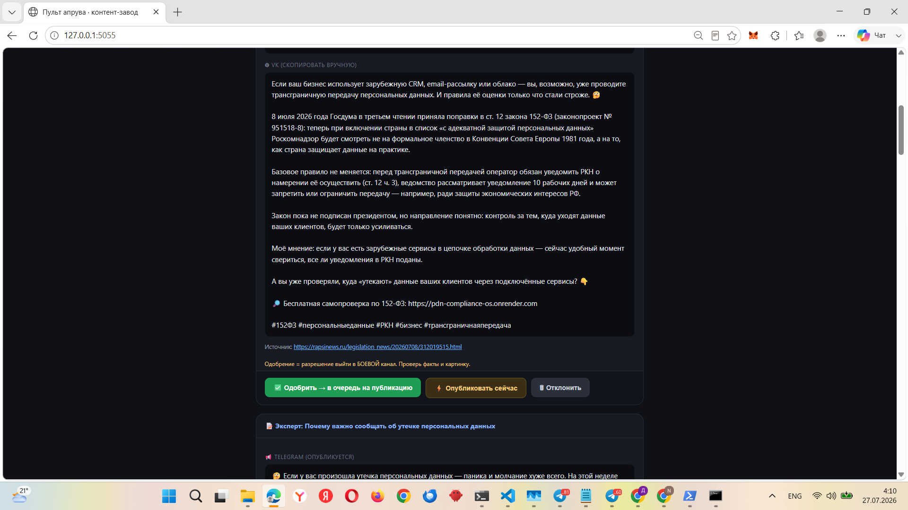
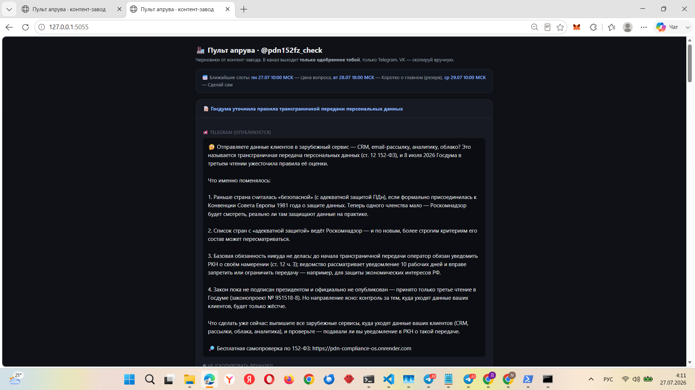
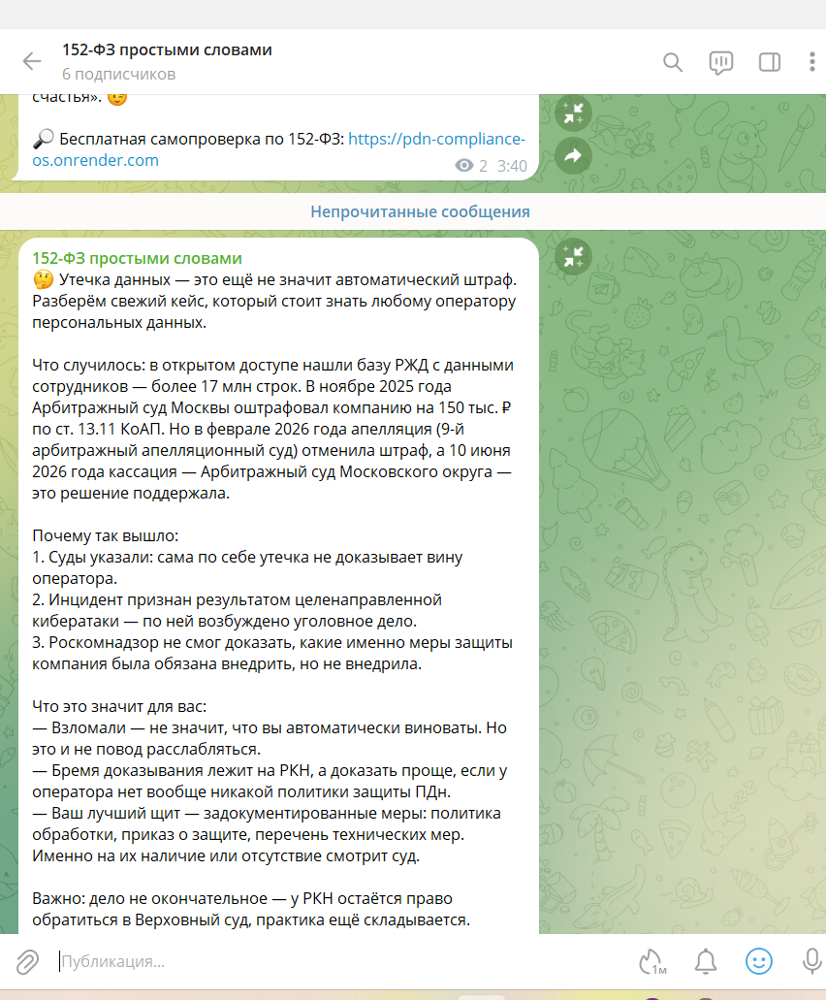
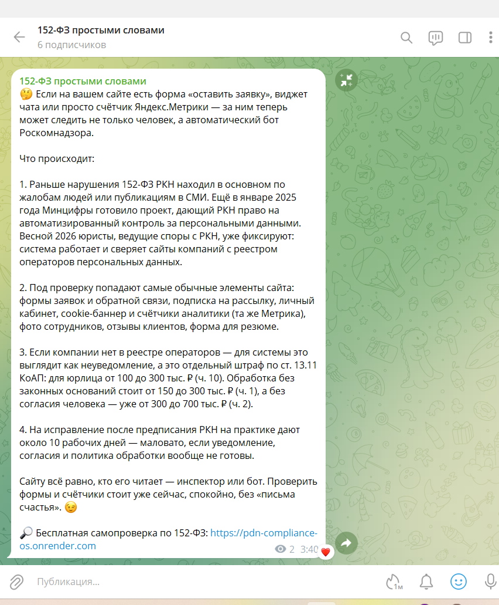

# 🏭 Контент-завод «152-ФЗ простыми словами»

Автономный AI-конвейер, который ведёт правовой Telegram-канал
[@pdn152fz_check](https://t.me/pdn152fz_check): сам находит свежую повестку по 152-ФЗ и
Роскомнадзору, **проверяет каждый факт до первоисточника**, собирает готовый черновик поста
с картинкой и кладёт его в очередь. Публикует — **только человек**, одним кликом.

**Живая витрина** (проект в проде, не макет):

- 📢 Канал: [t.me/pdn152fz_check](https://t.me/pdn152fz_check) — посты собраны этим заводом
- 🔎 Лендинг-продукт, на который ведёт каждый пост:
  [pdn-compliance-os.onrender.com](https://pdn-compliance-os.onrender.com)

---

## 1. Проблема

Ведение экспертного правового канала съедает часы ежедневно: мониторинг новостей РКН и
изменений 152-ФЗ, проверка формулировок, написание поста, картинка. При этом цена фактической
ошибки в правовой теме максимальна — выдуманная норма или неверная сумма штрафа рушит доверие
и может навредить читателю. Обычные AI-генераторы контента эту цену игнорируют: пишут складно,
но не проверяют.

## 2. Пользователь

Владелец экспертного канала / консультант по персональным данным, который хочет стабильный
поток проверенного контента без ежедневной рутины — но **не готов отдать публикацию роботу**.
Шире — любой, кто ведёт нишевый канал с высокой ценой ошибки (право, медицина, финансы).

## 3. Основная функция

Полный цикл «повестка → проверка → черновик → человек-гейт → публикация»:

**Вход:** ничего (плановый запуск по расписанию) или тема/ссылка от владельца.

**Конвейер:**

1. **Планировщик Windows** ежедневно запускает оркестратор (`content_factory_run.py`).
2. Оркестратор поднимает **AI-субагента** (`claude --agent content-factory`) — тот смотрит в
   `schedule.json`, какая рубрика у ближайшего слота, и ищет свежую повестку по карте
   источников (РКН, pravo.gov.ru, правовые базы), отсекая уже освещённое.
3. **Верификация:** каждая норма, статья, сумма, дата сверяется с первоисточником; неподтверждённое
   помечается `[уточнить]` и блокирует публикацию (см. [docs/EDITORIAL_POLICY.md](docs/EDITORIAL_POLICY.md)).
4. Собирается **один черновик**: JSON по схеме `social-content/v1` (тексты под Telegram и VK,
   выжимка для сайта, промпт картинки) + человекочитаемый предпросмотр → в очередь `drafts/`.
5. Картинка — `publisher/make_image.py` (OpenAI Images), путь вписывается в тот же JSON.
6. **Человек-гейт:** владелец открывает пульт (`run_console.bat` → 127.0.0.1:5055), видит
   пост, картинку и ближайшие слоты. «Одобрить» → пост уезжает в `approved/` со **снапшотом
   одобрения** (штамп времени + sha256 текста). «Опубликовать сейчас» — срочный выход мимо
   расписания. «Отклонить» → в `rejected/`.
7. **Доставщик** (`deliver.py`, будится планировщиком раз в час) смотрит, наступил ли слот, и
   публикует **самое старое одобренное**. Просроченное одобрение (по умолчанию 5 дней) и текст,
   правленный после одобрения, он не публикует — возвращает в `drafts/` на пересмотр.
8. `publisher/publish_telegram.py` отправляет пост в канал, `news_writer.py` добавляет пункт
   в новостную ленту сайта и **останавливается**: коммит и push на прод — рука владельца.

**Выход:** пост выходит в канал по сетке · лента сайта готова к отправке · аудит-след каждого шага.

**Чего конвейер не может:** опубликовать неодобренное. Планировщик поднимает только сборщика
черновиков; публикатор лежит вне его цепочки и запускается либо доставщиком (а тот берёт
исключительно из `approved/`), либо кликом человека.

## 4. Формат результата

- Пост в Telegram-канале (текст + картинка), вариант текста под VK — в том же JSON.
- Очередь черновиков с предпросмотром — видно, ЧТО и НА ОСНОВАНИИ ЧЕГО написано (источник в JSON).
- Новостная лента лендинга — обновлённый `news.json`, готовый к отправке.
- Громкий статус `_STATUS.md` после каждого прогона («готово/частично/ошибка» — и при провале
  тоже) + append-only журнал `_audit.md`: владелец никогда не гадает, ходил завод или нет.

## 5. Минимальный функционал (реализовано)

- [x] Автономный плановый прогон (Windows Task Scheduler, ежедневно) — без участия человека
- [x] AI-субагент с редполитикой: свежая повестка → верификация до первоисточника → черновик
- [x] Очередь черновиков + предпросмотры
- [x] Пульт апрува с человек-гейтом: одобрение ставит пост в очередь, публикация — по слоту
- [x] **Сетка публикаций и рубрики** (`schedule.json`, время по Москве): день недели задаёт
  угол подачи, тема всегда свежая; резервные слоты включаются только при полной очереди
- [x] **Автодоставка одобренного** по слотам, с догоном пропущенного в тот же день и защитой
  от двойной публикации
- [x] **Снапшот одобрения**: срок годности (5 дней) + sha256 текста — правка после одобрения
  снимает одобрение, устаревшее не публикуется
- [x] **Писатель новостной ленты** сайта (готовит `news.json`, push на прод оставляет человеку)
- [x] Публикатор Telegram + генератор картинок (секреты только в `.env`, вне git)
- [x] Рельсы наблюдаемости: громкий статус, append-only аудит, STOP-флаг (аварийный тормоз),
  «правда по файлу» — успех считается только по реально появившемуся черновику, не по коду возврата
- [x] Тесты логики расписания и одобрения (`tests/test_schedule.py`, 15 проверок, без сети и ключей)

**Дальше (roadmap):** дедуп-леджер опубликованных тем · производство вечнозелёного контента впрок
для резервных слотов · публикация в VK · универсальная редакторская панель над несколькими
заводами · серверная версия под агентом-оркестратором (замысел: [docs/WORK_ORDER.md](docs/WORK_ORDER.md)).

## 6. Технологии

| Слой | Чем сделано |
|---|---|
| Оркестратор и рельсы | Python 3 (stdlib), без внешних зависимостей |
| AI-редактор | Claude Code: субагент `.claude/agents/content-factory.md` + скилл `.claude/skills/pdn-content-factory/` |
| Расписание | `zoneinfo` — слоты живут по московскому времени независимо от таймзоны машины |
| Целостность одобрения | `hashlib` (sha256 публикуемого текста) |
| Пульт апрува | Flask (localhost), Telegram Mini App (HTML) |
| Картинки | OpenAI Images API (`gpt-image-1`) |
| Публикация | Telegram Bot API (без сторонних SDK) |
| Автономность | Windows Task Scheduler + `.bat`-лаунчеры (ASCII-only: `cmd` ломает UTF-8) |
| Секреты и настройки | `.env` вне git (шаблон `.env.example`), опционально секрет-брокер (`CF_VAULT`) |

## Запуск у себя

Нужны: Windows, Python 3.10+, [Claude Code CLI](https://claude.com/claude-code) (для AI-этапа),
токен Telegram-бота (админ вашего канала).

```bat
git clone https://github.com/DmGranit/pdn-content-factory.git
cd pdn-content-factory
pip install flask
copy .env.example .env        &REM вписать свои ключи СВОЕЙ рукой
```

Проверка без AI, ключей и сети:

```bat
python tests\test_schedule.py    &REM 15 проверок: слоты, срок годности, защита от подмены
set CF_DRAFT_MODE=stub
python content_factory_run.py    &REM рельсы: статус + заявка в drafts/
python deliver.py --dry          &REM что доставщик сделал бы сейчас, ничего не публикуя
```

Боевой прогон одного черновика: `run_scheduled.bat` (10–20 минут — агент ищет источники и
сверяет факты; нужен Claude CLI). **Окно консоли не закрывать** — прогон оборвётся на
полуслове; статус останется висеть «идёт», и следующий прогон пометит его «не завершился».
Прогон по расписанию идёт в фоне и этой проблемы не имеет.
Пульт апрува: `run_console.bat` → <http://127.0.0.1:5055>.

Сетка публикаций правится в [schedule.json](schedule.json) обычным блокнотом, без кода:
день недели, время (по Москве), рубрика и угол подачи.

Автоматика — две задачи:

```bat
schtasks /Create /TN PDN_ContentFactory_Draft   /SC DAILY  /ST 09:00 /TR "C:\путь\run_scheduled.bat"
schtasks /Create /TN PDN_ContentFactory_Deliver /SC HOURLY           /TR "C:\путь\run_deliver.bat"
```

Первая делает черновик раз в сутки, вторая раз в час проверяет, не наступил ли слот. Почасовой
опрос вместо задач в точное время — чтобы пост вышел, даже если ПК в момент слота был выключен.

## Скилл проекта — развернуть за вас

В репозитории лежит скилл [.claude/skills/factory-deploy/](.claude/skills/factory-deploy/SKILL.md):
откройте проект в Claude Code и скажите «разверни завод» — агент проведёт по шагам от проверки
окружения до планировщика, ни разу не тронув ваши ключи (их вписываете только вы).

Второй скилл, [.claude/skills/pdn-content-factory/](.claude/skills/pdn-content-factory/SKILL.md), —
это «редакционный устав» канала: голос, схема поста, стоп-правила точности. Его читает
AI-редактор перед каждым черновиком.

## Как это выглядит

### Пульт апрува — человек-гейт

Владелец видит готовый пост целиком (версии под Telegram и VK), источник, и решает судьбу
одной из трёх кнопок. **Пока он не нажал — в канал ничего не уйдёт.**



### Сетка слотов и рубрик

Сверху пульта — когда и с какой рубрикой выйдет то, что вы одобряете. Рубрика задаёт угол
подачи, тема всегда берётся самая свежая.



### Результат — посты в живом канале





### Статус прогона — завод отчитывается сам

После каждого прогона переписывается `_STATUS.md` — и при успехе, и при провале:

```markdown
# Контент-завод — статус последнего прогона

## готово  ·  2026-07-27 03:03:28 -> 2026-07-27 03:20:25 (16м 57с)

- **Шаги:** режим: claude --agent  ·  черновик: ok: 2026-07-26-transgranichnaya-peredacha-zakon-podpisan.json
- **Новые черновики:** 2026-07-26-transgranichnaya-peredacha-zakon-podpisan.json

> Черновики ждут АПРУВА владельца — завод НЕ публикует сам.
```

### Что завод делает с сомнительными фактами

Живой прогон 27.07. Агент нашёл новость «утечка базы Tele2 — 968 млн записей» и **сам её
отбраковал**: цифра кратно больше населения России, ни один второй источник не подтверждает.
В пост не пошло. Полный разбор каждого решения — в предпросмотре черновика:

- таблица провенанса: каждый несущий факт с двумя независимыми источниками;
- раздел «что НЕ вошло в пост и почему»;
- честная пометка, если первоисточник прочитать не удалось.

Примеры реальной продукции — в [examples/](examples/): черновики с провенансом
и опубликованный пост с картинкой.

## Принципы (чем этот завод отличается)

1. **Human-gate by design** — у AI нет технического пути опубликовать: публикатор запускается
   только действием человека. Это архитектура, а не обещание в промпте.
2. **Провенанс каждого факта** — источник едет в JSON вместе с постом; непроверенное блокирует
   выпуск. Складно ≠ верно.
3. **Честная наблюдаемость** — завод громко отчитывается и об успехе, и о провале; успех
   определяется по реально появившемуся файлу, а не по exit-коду.
4. **Секреты не в коде** — ключи живут в `.env`/локальном брокере, скрипты их не печатают,
   AI-агент их не видит.
